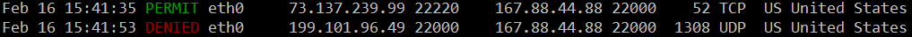

# colorize

A Bash script that parses iptables/netfilter firewall log lines and reformats them into easy-to-read, fixed-width column output with color highlighting and GeoIP country lookups.

## Example

Raw iptables log:
```
Feb 15 10:30:02 fw kernel: policy accepted IN=eth0 OUT= SRC=74.125.46.147 DST=199.101.96.49 LEN=42 PROTO=UDP SPT=57245 DPT=53
Feb 15 10:30:05 fw kernel: policy denied IN=eth0 OUT= SRC=192.168.1.100 DST=199.101.96.49 LEN=60 PROTO=TCP SPT=44821 DPT=8080
```

Colorized output:
```
Feb 15 10:30:02 PERMIT eth0   74.125.46.147   57245 125.101.96.49      53    42 UDP FI Finland
Feb 15 10:30:05 DENIED eth0   192.168.1.100   44821 125.101.96.49    8080    60 TCP -- unknown
```

PERMIT is displayed in green, DENIED in red.



## Requirements

- Bash 4+
- `geoiplookup` (from the `geoip-bin` package)

Install on Debian/Ubuntu:
```bash
sudo apt install geoip-bin
```

See the sections below on iptables and rsyslog for other requirements. colorize.sh can be adapted to many situations, but I've provided the script I use to setup iptables and the rsyslog configuration files I use. The combination of these enable colorize.sh to work. colorize.sh will not work on a generic iptables log file.

## Installation

```bash
git clone <repo-url> && cd colorize
chmod +x colorize.sh
```

Optionally symlink into your PATH:
```bash
sudo ln -s "$(pwd)/colorize.sh" /usr/local/bin/colorize
```

## Usage

```bash
# Pipe log lines from a file
cat /var/log/syslog | ./colorize.sh

# Follow a live log
tail -f /var/log/syslog | ./colorize.sh

# Search and colorize
grep 'policy' /var/log/syslog | ./colorize.sh

# Include non-matching lines in output
cat /var/log/syslog | ./colorize.sh -u

# Disable color (for piping to a file)
cat /var/log/syslog | ./colorize.sh --no-color > filtered.log
```

## Options

| Flag                     | Description                                           |
|--------------------------|-------------------------------------------------------|
| `-u`, `--show-unmatched` | Print non-matching lines as-is (default: skip them)   |
| `-n`, `--no-color`       | Disable ANSI color codes (useful for piping to files) |
| `-h`, `--help`           | Show usage information                                |

Lines that don't match any known prefix are suppressed by default (use `-u` to show them).

## iptables
iptables must have 3 chains added so denied and permitted traffic can be discerned by rsyslog (see below) and therefore by the colorize.sh script.

There is an example script to setup a simple but extensible iptables filter suitable to a host with a direct internet connection. The script is colorize/iptables/iptables.sh

The key of this script is the 3 chains it sets up for denied, denied by list, and permitted traffic. This allows colorize.sh to know which logs are which. By default iptables doesn't add any indicator as to whether a connection was permitted or denied, so we must add that info ourselves.

Also, default iptables does not log permitted traffic at all.

## rsyslog
rsyslog is required to send iptables logs to a specific log file /var/log/iptables.log

Otherwise iptables logs must be gathered via "journalctl -kf" or found in "/var/log/kern.log" along with all other "kern" logs. There is an example rsyslog.conf and example rsyslog.d with 3 files. Use these if they are suitable.

```bash
sudo apt install rsyslog
```

## License

MIT
